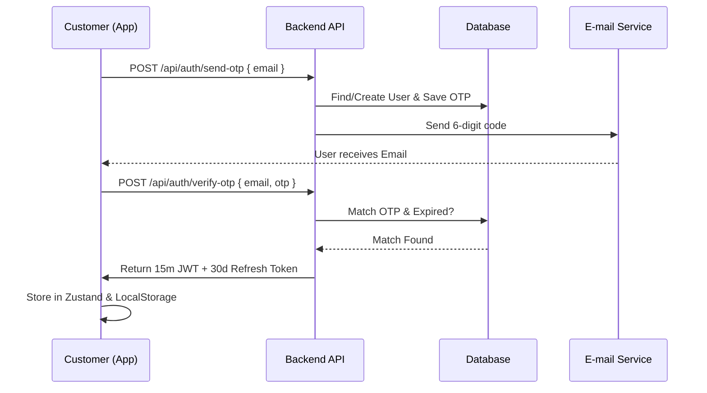

# 🔄 Data Flow Patterns

Understanding how data travels between the Client, API, and Database is crucial for debugging and optimization.

## 1. Authentication Flow (OTP & JWT)



## 2. Order Placement & GST Calculation

The logic flow starts from the checkout page once a **Pincode** is entered.

1. **Step 1:** Customer enters pincode.
2. **Step 2:** Frontend calls `api.get('/shipping/' + pincode)`. Returns `isDeliverable` and `shippingCharge`.
3. **Step 3:** Frontend `useCheckout` hook identifies the state (e.g., Delhi).
4. **Step 4:** Logic check:
   - If State == **Karnataka**: Split 18% into `CGST (9%)` + `SGST (9%)`.
   - If State != **Karnataka**: Apply `IGST (18%)`.
5. **Step 5:** Final JSON payload sent to `POST /api/orders`:
   ```json
   {
      "items": [...],
      "address": { "state": "Delhi", "pincode": "110001", ... },
      "pricing": {
          "total": 1259.42,
          "gst": { "type": "interstate", "igst": 192.11 }
      }
   }
   ```
6. **Step 6:** Backend validates calculation, generates `orderNumber` (e.g., DD-2025-101), and saves to MongoDB.

## 3. Image Upload (Design Workflow)

We use a "Proxy Upload" pattern to keep secrets on the backend while allowing fast streams.

1. **Upload:** Customer selects an image.
2. **Transfer:** Frontend sends `FormData` to `POST /api/upload/design`.
3. **Stream:** Backend middleware (`multer-storage-cloudinary`) streams the file chunks directly to Cloudinary.
4. **Return:** API returns the Cloudinary URL (e.g. `https://res.cloudinary.com/...`).
5. **Association:** Frontend stores this URL in the cart item state. When ordering, this URL is passed to the `Product` schema on the backend.

## 4. Admin Dispatch Flow

1. **Fetch:** Admin app fetches orders with `status: 'placed'`.
2. **Action:** Admin clicks "Dispatch" and enters `trackingNumber: "DTDC-001"`.
3. **Update:** API updates `Order` status to `dispatched`.
4. **Trigger:** `order.controller.js` triggers `emailService.sendDispatchEmail()`.
5. **Notification:** Customer receives email with tracking link.

---
[Related: 04-frontend/api-integration.md](../04-frontend/api-integration.md) | [Home](../README.md)
